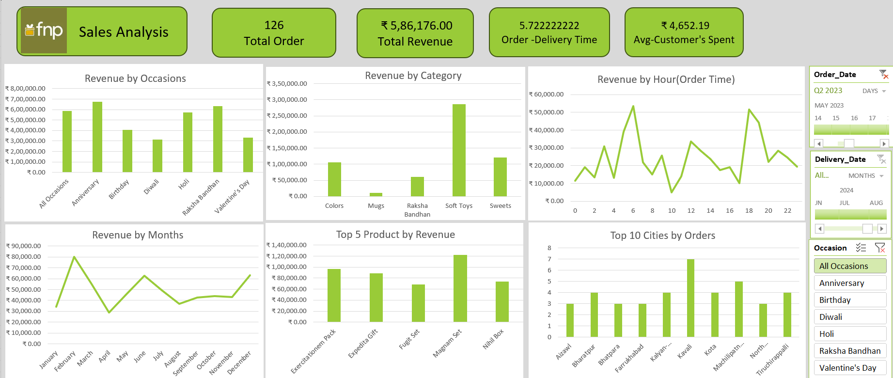

# 📊 Sales Analysis Dashboard (Excel)

An interactive **Sales Analysis Dashboard** built in Microsoft Excel to visualize and track key business metrics. This project turns raw sales data into actionable insights for decision-makers.

---

## ✨ Features

- **Total Orders & Revenue** – View overall business performance at a glance.
- **Average Customer Spend** – Understand per-order value to assess profitability.
- **Delivery Time Analysis** – Monitor average order-to-delivery times.
- **Occasion-Wise Sales** – Track sales across events like Anniversary, Holi, Diwali, etc.
- **Category Performance** – Compare revenue across product categories such as Colors, Soft Toys, Sweets, Cakes, Plants, and Mugs.
- **Time Insights** – Identify peak order hours and high-revenue months.
- **Top Products & Cities** – Discover best-performing products and regions.

---

## 🛠️ Tools Used

- **Microsoft Excel**  
- Pivot Tables  
- Charts & Graphs (Column, Bar, Line, Pie)  
- Slicers & Filters for interactivity  
- Conditional Formatting for highlights  

---

## 📈 Key Insights

- Total Revenue: **₹35.2 Lakh** from **1,000 orders** (Avg. spend: ₹3,520 per order).  
- Highest revenue occasions: **Anniversary & Holi (>₹6 Lakh each)**.  
- Top categories: **Colors, Soft Toys, Sweets** dominate revenue.  
- Orders peak at **2–4 AM and 18–20 hrs**; March & August are the best-performing months.  
- Cities like **Dhanbad, Imphal, and Kalyani** lead order volume.  
- Average delivery time: **5.53 days** – potential area for improvement.

---

## 🧑‍💻 About the Project

This dashboard was created as part of a personal learning project to improve my **data analytics and visualization skills** in Excel. It demonstrates how raw data can be transformed into **insightful dashboards** for businesses to make informed decisions.

---

### 🏷️ Tags  
`Excel` `Data Analytics` `Sales Dashboard` `Business Intelligence` `Data Visualization`
